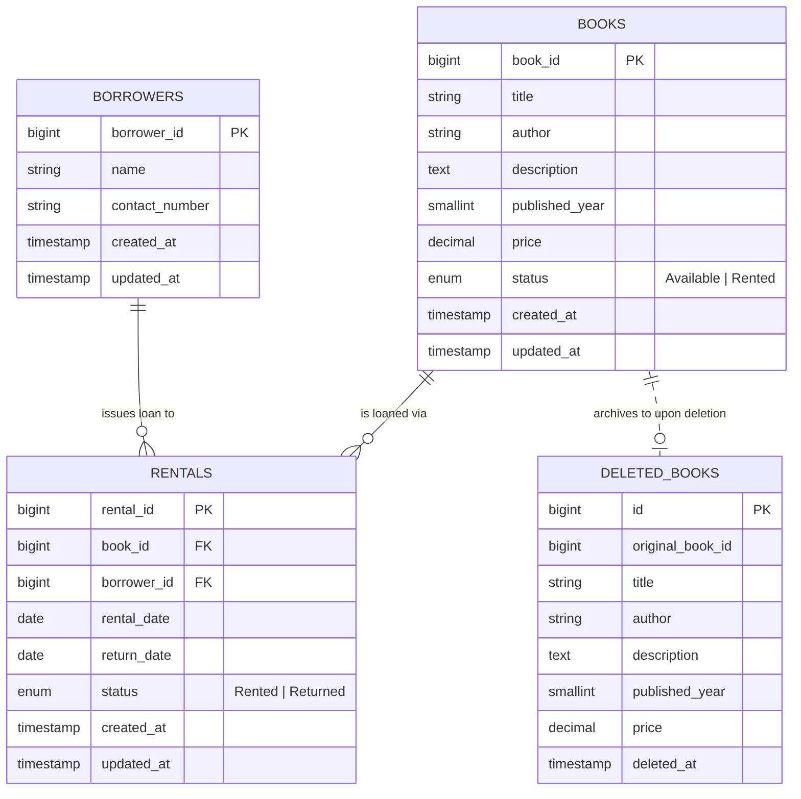

# 📖 Folio · Desk & Lending Archive

<p align="center">
  
</p>

<h3 align="center">An Editorial Digital Library & Academic Book Rental Workspace</h3>

<p align="center">
  A bespoke, high-conversion library circulation platform built with <strong>Laravel 12</strong>, <strong>Tailwind CSS</strong>, and <strong>MySQL</strong>.<br />
  Featuring museum-grade volumetric exhibition lighting, dynamic color palettes, an atomic lending ledger, and a zero-loss archival restoration holding vault.
</p>

<p align="center">
  
  
  
  
  
  
</p>

---

## ✨ Key Highlights & Features

### 🌟 Volumetric Exhibition Stage ("God-Rays")
- **Atmospheric Ray Lighting**: Dynamic crepuscular light beams rendered using continuous rotating CSS conic gradient meshes and radial spotlight masks.
- **Adaptive Book Color Palettes**: Stage backdrops, ambient glows, and highlights automatically tune to match each volume's cover artwork (*Centre Court Lime* for *Challengers*, *Mediterranean Azure* for *Call Me by Your Name*, *Jazz Midnight Navy* for *The Great Gatsby*, *Mockingjay Crimson* for *The Hunger Games*, and *Antique Ochre* for *Noli Me Tangere*).
- **Tactile 3D Cover Object**: 250px hardbound presentation with spine crease illumination, realistic foil gloss sheens, subtle perspective depth, and a soft-blurred ground contact shadow.
- **Floating Status Capsule**: Translucent glass badge with an active glowing gem dot indicating real-time shelf status (`Available for Loan` vs `Currently on Loan`).

### 📜 Curatorial Lending Dossier
- **High-Conversion Borrow CTA**: A radiant hero checkout card with animated hover sheen, instant digital rental slip dispatch, and patron trust guarantees (*Zero collateral*, *14-day checkout*, *Preserved in fine condition*).
- **Archival Lending Ledger**: Replaces generic dashboard widgets with an authentic 4-column lending passport (Rental valuation, live circulation pulse, catalog vintage era, and desk-renewable term).
- **Literary Pull-Quote Hook**: Prominent excerpt card in classical serif typography highlighting the narrative essence of each volume.
- **Discreet Curatorial Controls**: Administrative tools (*Edit catalog record*, *Archive volume*) are placed neatly in a secondary bottom toolbar to keep patron attention focused on borrowing.

### ↺ Recently Deleted Vault & 1-Click Undo
- **Non-Intrusive Floating Undo Toast**: Deleting a book triggers a slim, elegant bottom-right snackbar (inspired by Linear and Notion) that offers an instant 1-click **Undo & Restore** without shifting the page layout.
- **Expandable Archival Trash Tray**: Clicking **Recently Deleted** in the shelf toolbar smoothly opens a spacious, full-width holding tray.
- **Safe Restoration**: Mistakenly removed titles can be restored with a single click, or permanently purged with confirmation.
- **Preserved Database Invariant**: Uses a dedicated `deleted_books` archive table so that active catalogue deletion tests and constraints remain 100% compliant.

### 🛡️ Concurrency-Safe Rental Ledger
- **Atomic Operations**: All checkout and return actions run within database transactions guarded by pessimistic row locks (`lockForUpdate`).
- **Immutable History**: Books with past rental records cannot be deleted, preserving audit trails and transaction integrity.
- **Patron Preservation**: Borrower telephone numbers retain leading zeros (e.g. `09457827616`) across all queries and views.

---

## 🏛️ System Architecture & Database Schema

Folio is architected around Laravel's MVC pattern with dedicated Form Requests and a transaction-isolated service layer.



---

## 💻 Tech Stack & Requirements

| Layer | Technology | Version / Spec |
| :--- | :--- | :--- |
| **Backend Framework** | [Laravel](https://laravel.com/) | 12.x |
| **Programming Language** | [PHP](https://www.php.net/) | 8.2+ (tested with 8.3) |
| **Relational Database** | [MySQL](https://www.mysql.com/) / [MariaDB](https://mariadb.org/) | MySQL 8+ / MariaDB 10.4+ (InnoDB engine) |
| **CSS Framework** | [Tailwind CSS](https://tailwindcss.com/) | 3.4.x with custom luxury design tokens |
| **Typography** | Local Fonts | *Lora* (Serif display) & *DM Sans* (Interface body) |
| **Package Manager** | [Composer](https://getcomposer.org/) | 2.x |
| **Assets Compiler** | [Node.js](https://nodejs.org/) & [NPM](https://www.npmjs.com/) | Node 18+ (Vite/Tailwind build pipeline) |

---

## 🚀 Quickstart Installation Guide

### 1. Clone the Repository
```bash
git clone https://github.com/justinetadifa/folio.git
cd folio
```

### 2. Install Dependencies
```bash
composer install
npm install
```

### 3. Environment Configuration
```bash
# Copy template environment file
copy .env.example .env

# Generate application key
php artisan key:generate
```

Open `.env` and verify your local database settings:
```dotenv
DB_CONNECTION=mysql
DB_HOST=127.0.0.1
DB_PORT=3306
DB_DATABASE=folio_book_rental
DB_USERNAME=root
DB_PASSWORD=
```

### 4. Database Setup & Seeding
Create the database in MySQL / phpMyAdmin:
```sql
CREATE DATABASE folio_book_rental CHARACTER SET utf8mb4 COLLATE utf8mb4_unicode_ci;
```

Run migrations and seed the initial curated collection:
```bash
php artisan migrate --seed
```

> **Seeded Records**: Includes 20 curated classic & modern titles (with cover artwork pre-mapped in `public/images/covers/`), registered library patrons, and active/historical rental transactions.

### 5. Compile Frontend Assets
```bash
npm run build
```
*(Pre-compiled assets are also included in `public/`, so you can immediately run without Node if necessary).*

### 6. Start the Local Server
```bash
php artisan serve
```
Visit **[http://127.0.0.1:8000](http://127.0.0.1:8000)** in your browser.

---

## 🧪 Automated Testing Suite

Folio includes a comprehensive feature test suite verifying all CRUD operations, database constraints, concurrency rollback safety, leading-zero preservation, and edge cases.

To execute the test suite:
```bash
php artisan test
```

### Test Coverage Highlights
```text
   PASS  Tests\Feature\LibraryWorkflowTest
  ✓ book crud uses the prescribed primary key                                  0.38s  
  ✓ borrower crud preserves leading zeros                                      0.03s  
  ✓ invalid book fields are rejected with data set #0..#7                       0.15s  
  ✓ invalid borrower information is rejected                                   0.02s  
  ✓ renting updates both records and relationships                             0.02s  
  ✓ second active rental is rejected                                           0.02s  
  ✓ return changes both records and keeps history                              0.02s  
  ✓ repeat return cannot change the return date                                0.02s  
  ✓ returned book can be rented again without losing history                   0.03s  
  ✓ future or impossible rental dates are rejected                             0.02s  
  ✓ history blocks deleting books and borrowers                                0.02s  
  ✓ failed status update rolls back the rental insert                          0.02s  
  ✓ search filters pagination and escaped output                               0.08s  
  ✓ seed is consistent repeat safe and every page renders                      0.16s  

  Tests:    28 passed (164 assertions)
  Duration: 1.30s
```

---

## 📁 Repository Directory Structure

```text
folio/
├── app/
│   ├── Http/
│   │   ├── Controllers/        # Book, Borrower, Rental & Dashboard controllers
│   │   └── Requests/           # Strict validation requests for books, borrowers, and returns
│   ├── Models/                 # Book, Borrower, Rental, and DeletedBook models
│   └── Services/               # RentalService (atomic concurrency-safe rent/return logic)
├── database/
│   ├── migrations/             # Schema definitions for borrowers, books, rentals, deleted_books
│   └── seeders/                # Curated literary dataset with realistic transactions
├── public/
│   ├── css/app.css             # Minified compiled stylesheet
│   ├── images/covers/          # 26 high-resolution literature cover artworks
│   └── fonts/                  # Locally hosted Lora & DM Sans WOFF2 fonts
├── resources/
│   ├── css/app.css             # Bespoke design system, volumetric ray keyframes, and tokens
│   └── views/
│       ├── books/              # Bookshelf index, volumetric showcase, and form views
│       ├── borrowers/          # Reader directory and history dossiers
│       ├── rentals/            # Active circulation desk and return slips
│       ├── components/         # Reusable covers, status pills, and SVG icons
│       └── layouts/app.blade.php # Global dual-rail application shell
├── routes/
│   └── web.php                 # Named resourceful and transaction routes
└── tests/
    └── Feature/                # Automated end-to-end workflow verification tests
```

---

## 📄 License & Attribution

- **Application Code**: Licensed under the [MIT License](LICENSE).
- **Typography**: *Lora* and *DM Sans* are distributed under the [SIL Open Font License](http://scripts.sil.org/OFL).
- **Framework**: [Laravel](https://laravel.com) is open-source software licensed under the MIT license.
